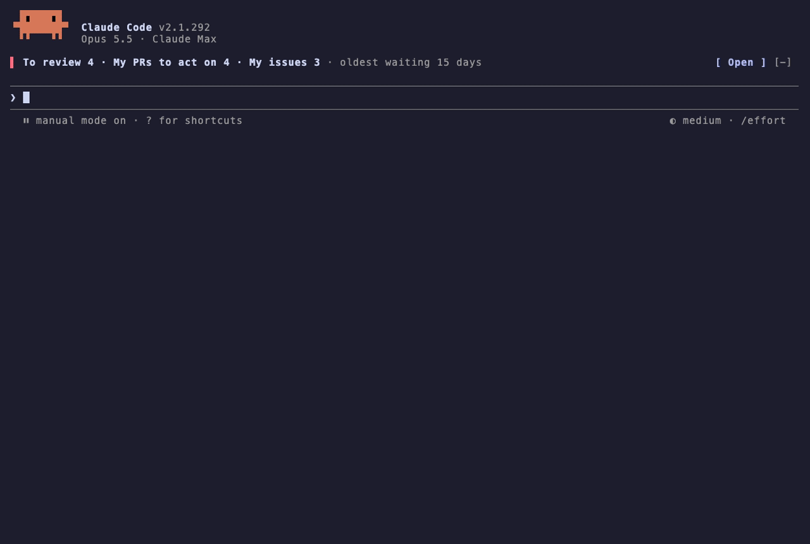
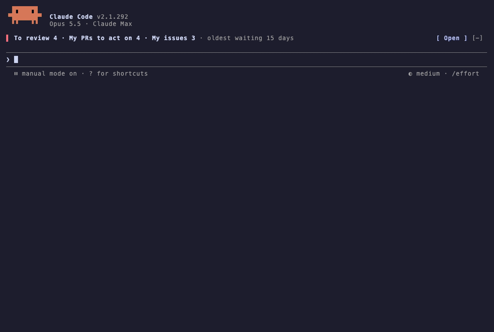
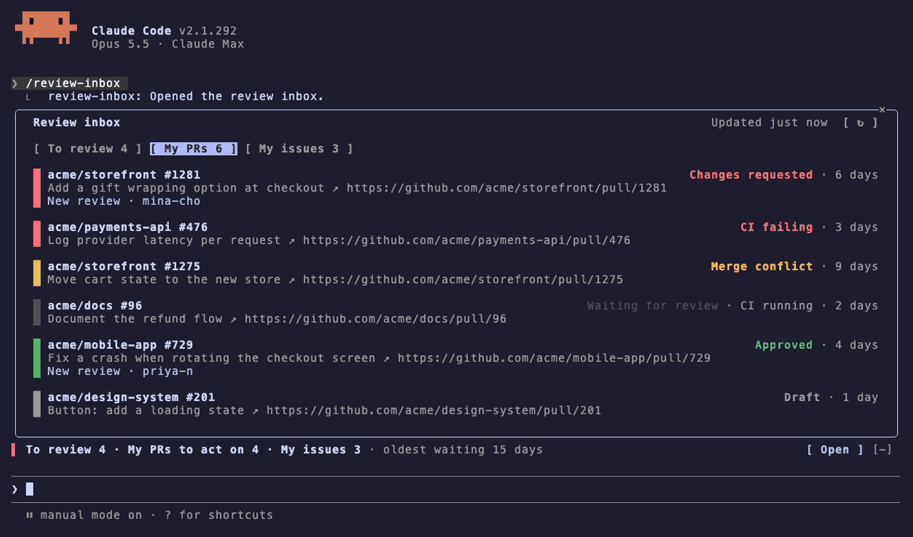
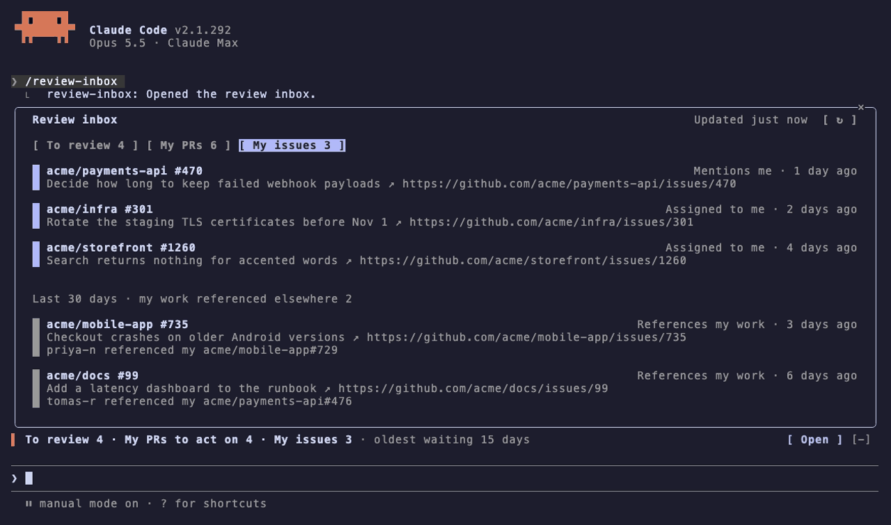
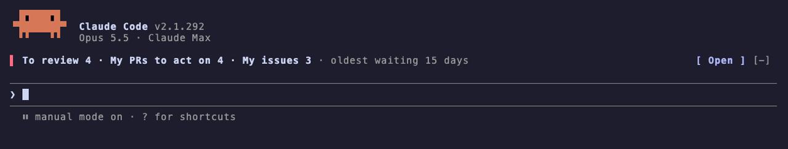

# Review Inbox

[](https://mods.aidojo.si/#SummerRiversound--review-inbox--review-inbox)

[English](README.md) | [한국어](README.ko.md) | [日本語](README.ja.md) | [简体中文](README.zh-CN.md) | [繁體中文](README.zh-TW.md) | [Español](README.es.md) | [Português](README.pt-BR.md) | **Deutsch** | [Français](README.fr.md)

Eine Mod für [Claude Code](https://claude.com/claude-code), die Ihre GitHub-Arbeit beim Programmieren sichtbar hält: Pull Requests, die auf Ihr Review warten – jeder in verständlicher Sprache zusammengefasst, bevor Sie ihn öffnen –, Ihre eigenen offenen PRs mit den Reviews, die sie erhalten, und die Issues, in die Sie einbezogen werden.

- **Leiste über dem Prompt** – eine Zeile, die nur zählt, was Ihr Zutun erfordert: PRs, die auf Ihr Review warten, Ihre PRs, bei denen etwas zu tun ist, und Issues, die Ihnen zugewiesen sind oder Sie erwähnen. Ihre Farbe zeigt, wie lange die älteste Review-Anfrage schon wartet (gelb ab 3 Tagen, rot ab 14). `Öffnen` öffnet das Panel.
- **Panel „Review-Posteingang“** – `/review-inbox`, mit drei Tabs: Zu reviewen, Meine PRs und Meine Issues.
- **Benachrichtigungen** – ein kurzer Hinweis, wenn während der Arbeit etwas Neues eintrifft.



Oberfläche und Zusammenfassungen gibt es in neun Sprachen; siehe [Sprache](#sprache).

## Tabs

### Zu reviewen

Eine Karte pro PR, der auf Ihr Review wartet: eine Zusammenfassung in einem Satz, der Grund für den PR, seine Auswirkungen, Größe und Autor sowie die Zeit, seit der Ihr Review aussteht. Riskante Punkte wie eine Schemaänderung oder eine vorgeschriebene Deploy-Reihenfolge werden mit ⚠️ markiert.

- `Reviewen` markiert die Karte als `Hinzugefügt` und lässt das Panel geöffnet, sodass Sie mehrere PRs auswählen können. Wenn Sie das Panel schließen (Esc oder ×), wird für jeden hinzugefügten PR eine Review-Anfrage in Ihren Prompt eingefügt, samt Warnhinweisen und den Änderungen seit Ihrem letzten Review. Gesendet wird erst, wenn Sie Enter drücken. Ein PR, für den Ihr bereits eingegebener Text schon eine Anfrage enthält, erscheint beim Öffnen des Panels als `Hinzugefügt`.
- `Ausblenden` blendet die Karte aus, bis der PR einen neuen Commit erhält.
- `erneut angefragt` kennzeichnet einen PR, den Sie bereits reviewt haben und der Sie erneut anfragt, mit einer kurzen Zusammenfassung der Änderungen seit Ihrem letzten Review.
- Direkte Anfragen stehen vor Team-Anfragen. Entwürfe werden separat aufgeführt.



Die Anfrage enthält außerdem eine Zeile, die beschreibt, wie Sie üblicherweise reviewen, damit Claude so reviewt, wie Sie es tun würden. Einmal pro Woche liest die Mod Ihre eigenen Kommentare zu bis zu 30 PRs, die Sie kürzlich reviewt haben, und lässt Claude Ihre Sprache und Ihren Ton beschreiben, worauf Sie zuerst achten und wie Sie Bitten formulieren. Liegen weniger als fünf Kommentare zum Lernen vor, geht die Anfrage ohne diese Zeile hinaus; schlägt das Lernen fehl, bleibt die letzte Beschreibung erhalten und die Mod versucht es einen Tag später erneut.

### Meine PRs

Ihre offenen PRs, statt mit einer Zusammenfassung mit ihrem Zustand, in der Reihenfolge, in der Sie tätig werden müssen: Änderungen angefordert, CI fehlgeschlagen, Mergekonflikt, wartet auf Review (älteste zuerst), genehmigt, Entwurf. Läuft gerade eine CI, steht „CI läuft“ neben dem Zustand.



Ein Review, das nach Ihrem letzten Commit eingereicht wurde, erscheint als `Neues Review` mit Angabe, von wem es stammt, bis Sie erneut committen. Das umfasst Genehmigungen, Änderungsanforderungen und reine Kommentar-Reviews einschließlich Antworten in Threads, von Menschen wie von Bots; ein verworfenes (dismissed) Review zählt nicht. Ein solcher PR zählt als zu bearbeiten und steht vor PRs ohne Neuigkeiten im selben Zustand. Es wird kein Modell aufgerufen.

### Meine Issues

Offene Issues, die Ihnen zugewiesen sind, sowie offene Issues und PRs, die Sie erwähnen; ein Eintrag, auf den beides zutrifft, erscheint nur einmal, als „Mir zugewiesen“. Darunter stehen andere Issues und PRs aus den letzten 30 Tagen, die auf eines Ihrer Issues oder einen Ihrer PRs verwiesen haben, jeweils mit Angabe, von wem. Verweise, die Sie selbst gesetzt haben, werden ausgelassen, und nur die neuesten 20 werden angezeigt. Es wird kein Modell aufgerufen.



### Benachrichtigungen

Benachrichtigt wird bei einer neuen Review-Anfrage, einem neuen Review zu einem Ihrer PRs, wenn einer Ihrer PRs zu „Änderungen angefordert“, „CI fehlgeschlagen“ oder „Mergekonflikt“ wechselt, sowie bei einer neuen Zuweisung, Erwähnung oder einem neuen Verweis. Wenn eine Sitzung die Listen zum ersten Mal liest, wird nichts gemeldet. Treffen mehrere gleichzeitig ein, erscheinen sie nacheinander im Abstand von viereinhalb Sekunden.



## Voraussetzungen

- Claude Code 2.1.287 oder neuer, die ersten Builds mit Mods (Function-Hook-Plugins). Getestet mit 2.1.292. Mods befinden sich im Early Access, und ihre API kann sich zwischen Releases ändern.
- [GitHub CLI](https://cli.github.com/) (`gh`) im `PATH`, angemeldet (`gh auth login`) und mit Zugriff auf die Repositories, die Sie reviewen.
- GitHub Enterprise Server: Setzen Sie `GH_HOST` in der Umgebung, in der Claude Code startet; jeder `gh`-Aufruf geht dann an diesen Host.

## Installation

Im Prompt einer Sitzung von Claude Code:

```text
/plugin marketplace add https://github.com/SummerRiversound/review-inbox.git
/plugin install review-inbox@review-inbox
```

Der Installationsbildschirm fragt die unten beschriebenen Optionen ab; alle können leer bleiben oder ihren Standardwert behalten.

### Aktualisieren und deinstallieren

```sh
claude plugin marketplace update review-inbox
claude plugin update review-inbox@review-inbox
claude plugin uninstall review-inbox@review-inbox
```

Ein Update wird nach einem Neustart wirksam. Beim Deinstallieren bleibt der Cache-Ordner der Mod, `~/.claude/plugins/data/review-inbox`, erhalten; löschen Sie ihn selbst, um die zwischengespeicherten Listen und Zusammenfassungen zu entfernen. Was sich in den einzelnen Versionen geändert hat, steht im [Changelog](CHANGELOG.md).

## Konfiguration

Die Optionen werden auf dem Installationsbildschirm gesetzt und lassen sich später in `/config` ändern. Eine Änderung gilt sofort.

| Option | Standard | Beschreibung |
| --- | --- | --- |
| `scope` | leer | GitHub-Suchqualifizierer, die an jede Suche angehängt werden (`review-requested:@me`, `author:@me`, `assignee:@me`, `mentions:@me`). Leer bedeutet: ganz GitHub. |
| `githubUser` | leer | Das `gh`-Konto, das verwendet wird, wenn mehrere angemeldet sind (`gh auth token -u <user>`). Leer verwendet das aktive Konto. |
| `language` | `auto` | `auto` oder einer der Codes unter [Sprache](#sprache). |

`scope` akzeptiert alles, was die [Issue- und PR-Suche](https://docs.github.com/en/search-github/searching-on-github/searching-issues-and-pull-requests) von GitHub akzeptiert:

```text
org:my-org
org:my-org org:other-org
repo:owner/name repo:owner/other
org:my-org -repo:my-org/noisy-repo
user:my-username
```

Wiederholte Qualifizierer `org:`, `repo:` und `user:` treffen zu, sobald einer von ihnen passt. Eine Team-Review-Anfrage zählt als Anfrage an Sie, so wie GitHubs `review-requested:@me` es definiert.

## Sprache

Leiste, Panel, Benachrichtigungen, die in Ihren Prompt eingefügte Review-Anfrage sowie die Zusammenfassungen und die Beschreibung Ihres Review-Stils, die das Modell schreibt, verwenden alle dieselbe Sprache.

| Code | Sprache |
| --- | --- |
| `en` | Englisch (English) |
| `ko` | Koreanisch (한국어) |
| `ja` | Japanisch (日本語) |
| `zh-CN` | Vereinfachtes Chinesisch (简体中文) |
| `zh-TW` | Traditionelles Chinesisch (繁體中文) |
| `es` | Spanisch (Español) |
| `pt-BR` | Brasilianisches Portugiesisch (Português do Brasil) |
| `de` | Deutsch |
| `fr` | Französisch (Français) |

- Ein Code wählt die jeweilige Sprache.
- `auto` (der Standard) folgt der `language`-Einstellung von Claude Code selbst, sofern sie eine dieser Sprachen nennt – per Code, englischem Namen oder Eigenbezeichnung (`ja-JP`, `Japanese`, `日本語`). Andernfalls folgt es der Locale des Systems (`LC_ALL`, `LC_MESSAGES`, dann `LANG`), und sonst gilt Englisch. Chinesisch wird als vereinfachtes Chinesisch gelesen, sofern es nicht als Taiwan, Hongkong, Macau oder traditionell gekennzeichnet ist (`zh-TW`, `zh-Hant`, `繁體中文`), Portugiesisch als brasilianisches Portugiesisch.

Zusammenfassungen und die Beschreibung Ihres Review-Stils werden pro Sprache zwischengespeichert; nach einem Wechsel werden daher jede Zusammenfassung und diese Beschreibung einmal neu in der neuen Sprache geschrieben. Jede andere Sprache fällt auf Englisch zurück.

Alle Sprachen außer Englisch und Koreanisch wurden mit Claude übersetzt und noch nicht von Muttersprachlern geprüft; dasselbe gilt für diese README. Korrekturen sind als Issue oder Pull Request willkommen: Jede Sprache ist eine Datei in [`hooks/locales/`](hooks/locales/), und die englische Tabelle, nach der sich alle anderen richten, steht in [`hooks/i18n.ts`](hooks/i18n.ts).

## Was die Mod liest und ausführt

Die Mod greift nur über Ihr eigenes `gh` auf GitHub zu, sendet PR-Texte an Claude, um die Zusammenfassungen zu schreiben, einmal pro Woche außerdem Ihre eigenen Review-Kommentare, um Ihren Stil zu beschreiben, und schreibt nur in ihren eigenen Cache-Ordner. Im Folgenden steht alles, worauf sie zugreift, und warum; die Liste entspricht dem, was `claude plugin validate .` für die Mod ausgibt.

[](https://mods.aidojo.si/#SummerRiversound--review-inbox--review-inbox)

- **Führt `gh` aus**: `gh api graphql` für die Listen und einmal pro Woche für Ihre letzten Review-Kommentare; `gh api repos/<owner>/<repo>/compare/<from>...<to>` für einen erneut angefragten PR, und `gh auth token -u <githubUser>`, wenn `githubUser` gesetzt ist. Weitere eigene Netzwerkaufrufe macht die Mod nicht.
- **Fragt Claude** (Modell `sonnet`) nach jeder Zusammenfassung und sendet dabei Repository-Namen, Titel, Beschreibung (die ersten 12.000 Zeichen), geänderte Dateipfade (bis zu 80) und Größe eines PRs; bei einem erneut angefragten PR außerdem die erste Zeile jeder Commit-Nachricht und bis zu 60 Dateipfade seit Ihrem letzten Review. Das wird auf Ihre Nutzung von Claude Code angerechnet. Jeder PR wird pro Head-Commit und Sprache einmal zusammengefasst; eine fehlgeschlagene Zusammenfassung wird pro Commit höchstens dreimal versucht. Einmal pro Woche sendet die Mod außerdem Ihre eigenen Review-Kommentare zu bis zu 30 PRs, die Sie kürzlich reviewt haben – jeder auf 500 Zeichen gekürzt, höchstens 60 davon und insgesamt 12.000 Zeichen –, um Ihren Review-Stil zu beschreiben; bei weniger als fünf wird nichts gesendet.
- **Schreibt Dateien** nur in ihren Cache-Ordner, `~/.claude/plugins/data/review-inbox` (ist `CLAUDE_CONFIG_DIR` gesetzt, tritt es an die Stelle von `~/.claude`). `inbox-<hash>.json` enthält die Listen und Zusammenfassungen, `hidden-<hash>.json` die ausgeblendeten PRs und `style-<hash>.json` die Beschreibung Ihres Review-Stils.
- **Liest Umgebungsvariablen**: `CLAUDE_CONFIG_DIR`, `HOME` und `USERPROFILE`, um diesen Ordner zu finden; `LC_ALL`, `LC_MESSAGES` und `LANG` nur, wenn `language` auf `auto` steht. Sie setzt keine.
- **Liest Einstellungen von Claude Code** nur, wenn `language` auf `auto` steht, und verwendet nur den Schlüssel `language`.
- **Liest und befüllt Ihren Prompt** nur rund um das Panel: Beim Öffnen des Panels liest sie den bereits eingegebenen Text, um die PRs zu markieren, für die er schon eine Anfrage enthält, und beim Schließen fügt sie die Anfragen für die von Ihnen hinzugefügten PRs in neuen Zeilen nach diesem Text an.

## Funktionsweise

Alle Ihre offenen Sitzungen teilen sich einen Abruf: Eine Sitzung fragt GitHub höchstens alle 10 Minuten ab, die anderen lesen, was sie gespeichert hat.

Jede offene Sitzung von Claude Code führt die Mod aus, doch alle teilen sich eine Cache-Datei pro Konto, Scope und Sprache; dasselbe gilt für ausgeblendete PRs. Jede Sitzung liest diese Datei alle 30 Sekunden. Nur die Sitzung, die sie älter als 10 Minuten vorfindet und sich eine kurzzeitige Sperre sichert, ruft GitHub ab – zehn offene Sitzungen erzeugen also eine einzige Anfrage. Die abrufende Sitzung erneuert ihre Sperre, solange sie arbeitet; eine Sperre, die 3 Minuten lang nicht erneuert wurde, wird übernommen. Ein fehlgeschlagener Abruf behält die letzten gültigen Listen und wird nach einer Minute wiederholt. `↻` im Panel ruft sofort ab.

Eine einzige GraphQL-Suche liefert alle PRs, die auf Ihr Review warten, samt allem, was die Karten brauchen; eine weitere Anfrage mit drei Suchen füllt Meine PRs und Meine Issues. Verweise stammen aus den Cross-Reference-Ereignissen der PRs und Issues, die Sie erstellt haben. GitHub aktualisiert `updatedAt` eines Eintrags nicht, wenn etwas auf ihn verweist; daher werden Einträge, an denen sich in den letzten 60 Tagen etwas getan hat, auf Verweise aus den letzten 30 Tagen geprüft, 50 Einträge pro Anfrage. Lehnt GitHub die Verweissuche ab (es gilt ein Ressourcenlimit pro Abfrage), bleiben die letzten Verweise erhalten, und die anderen Tabs werden trotzdem aktualisiert.

## Einschränkungen

- Höchstens 100 PRs, die auf Ihr Review warten, in GitHubs Reihenfolge nach bester Übereinstimmung. Die anderen Tabs lesen bis zu 100 Ihrer offenen PRs, 50 zugewiesene und 50 Sie erwähnende Issues sowie Verweise aus bis zu 500 kürzlich geänderten Einträgen, jeweils mit der neuesten Aktivität zuerst.
- Ein Verweis auf einen Eintrag, den Sie seit 60 Tagen nicht angefasst haben, wird nicht erfasst.
- `Neues Review` verschwindet bei jedem neuen Commit auf dem PR, auch bei einem, den GitHubs Schaltfläche „Update branch“ oder ein Bot erstellt hat.
- Nach einem Force-Push, der den von Ihnen reviewten Commit umgeschrieben hat, zeigt ein erneut angefragter PR keine Zeile „Seit meinem letzten Review“.
- Ihr Review-Stil wird aus den PRs gelernt, die GitHubs Suche für `reviewed-by:@me -author:@me` innerhalb von `scope` liefert; Kommentare zu PRs, die Sie selbst erstellt haben, zählen daher nicht. Kommentare in der Unterhaltung eines PRs außerhalb eines Reviews fließen nicht ein.

## Fehlerbehebung

- **Das Panel zeigt einen `gh`-Fehler.** Führen Sie `gh auth status` aus. Sind mehrere Konten angemeldet, setzen Sie `githubUser`. Die Mod versucht es jede Minute erneut.
- **Die Leiste erscheint nicht.** Sie wird nur angezeigt, wenn etwas Ihr Zutun erfordert; Nullwerte werden ausgelassen.
- **Die Sprache ist nicht die erwartete.** Setzen Sie `language` in `/config` auf einen Sprachcode statt auf `auto`.
- **Etwas anderes.** Starten Sie Claude Code mit `claude --debug`; Zeilen dieser Mod beginnen mit `review-inbox:`.

## Entwicklung

```sh
claude plugin validate .
claude plugin test .
claude --plugin-dir .
```

`claude plugin validate` und `claude plugin test` benötigen keine Anmeldung, und die CI führt beide auf dem getesteten Build von Claude Code aus. `tsconfig.json` erweitert `.claude-plugin/types/tsconfig.json`, das Claude Code beim ersten Laden der Mod aus diesem Ordner schreibt (und `.gitignore` ausschließt); führen Sie daher `claude --plugin-dir .` einmal aus, bevor Sie mit `tsc -p .` die Typen prüfen.

## Unterstützung

Wenn Review Inbox Ihnen Zeit spart, können Sie mir [einen Kaffee spendieren](https://ko-fi.com/riversound) ☕ – das hilft, das Projekt weiterzuführen. Vielen Dank!

<a href="https://ko-fi.com/riversound"></a>

## Lizenz

[MIT](LICENSE)
