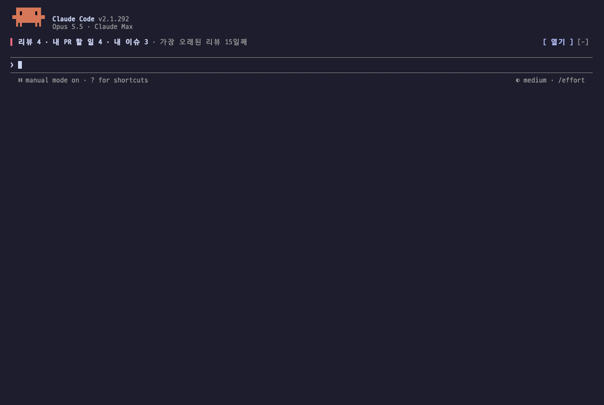
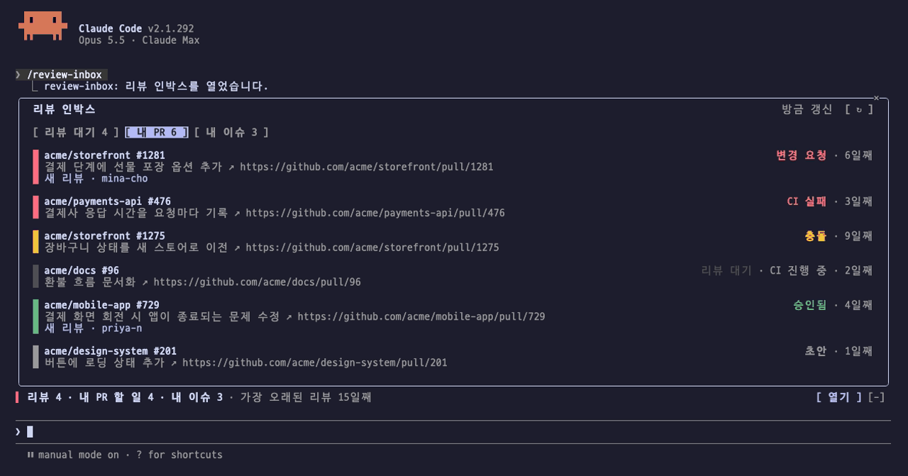
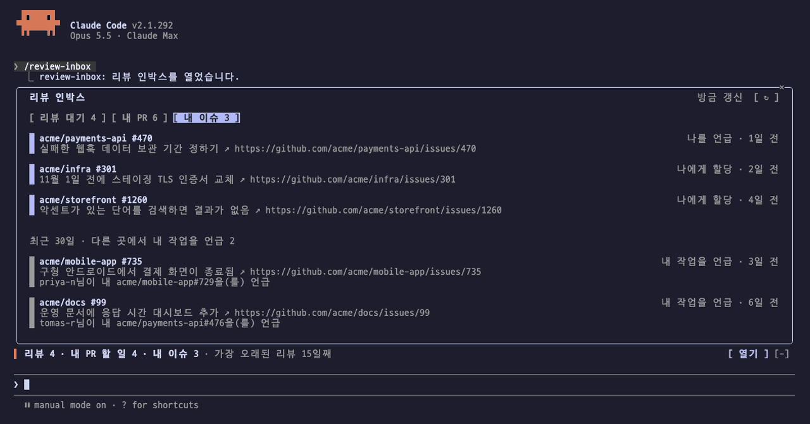
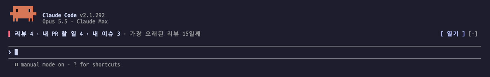

# Review Inbox

[](https://mods.aidojo.si/#SummerRiversound--review-inbox--review-inbox)

[English](README.md) | **한국어** | [日本語](README.ja.md) | [简体中文](README.zh-CN.md) | [繁體中文](README.zh-TW.md) | [Español](README.es.md) | [Português](README.pt-BR.md) | [Deutsch](README.de.md) | [Français](README.fr.md)

내 GitHub 일을 Claude Code 안에서 보여 주는 mod입니다. 내 리뷰를 기다리는 PR은 열어 보기 전에 쉬운 말로 요약해 보여 주고, 내가 연 PR과 거기 달린 리뷰, 나를 부르는 이슈도 함께 보여 줍니다.

- **입력창 위 한 줄** — 지금 내가 처리할 것만 셉니다. 내 리뷰를 기다리는 PR, 할 일이 생긴 내 PR, 나에게 할당되었거나 나를 언급한 이슈입니다. 색은 가장 오래 기다린 리뷰 요청의 경과일입니다(3일부터 노랑, 14일부터 빨강). `열기`를 누르면 목록 창이 열립니다.
- **목록 창** — `/review-inbox`. 리뷰 대기, 내 PR, 내 이슈 세 탭으로 구성됩니다.
- **알림** — 작업 중 새 항목이 생기면 짧게 알립니다.



화면과 요약은 9개 언어로 표시할 수 있습니다. [언어 설정](#언어-설정)을 참고하십시오.

## 탭 구성

### 리뷰 대기

내 리뷰를 기다리는 PR마다 카드 한 장을 보여 줍니다. 한 문장 요약, PR 이유, 영향 범위, 변경 규모와 작성자, 리뷰 대기 일수가 들어갑니다. DB 스키마 변경이나 배포 순서 제약처럼 위험한 항목에는 ⚠️를 붙입니다.

- `리뷰하기`를 누르면 카드에 `추가됨`이 표시되고 목록 창은 그대로 열려 있어, PR 여러 개를 고를 수 있습니다. 목록 창을 닫으면(Esc 또는 ×) 추가한 PR마다 리뷰 요청 문장이 입력창에 들어갑니다. 주의할 점과 지난 내 리뷰 이후 바뀐 점도 함께 붙습니다. Enter를 누르기 전에는 아무것도 보내지 않습니다. 작성 중인 내용에 이미 요청한 PR은 목록 창을 열 때 `추가됨`으로 표시됩니다.
- `숨기기`는 그 PR에 새 커밋이 올라올 때까지 카드를 숨깁니다.
- `재요청`은 이미 리뷰한 PR이 다시 리뷰를 요청한 경우입니다. 지난 리뷰 이후 바뀐 점을 짧게 요약해 함께 보여 줍니다.
- 직접 요청을 팀 요청보다 먼저 보여 주고, 초안은 따로 모아 보여 줍니다.


리뷰 요청에는 내가 평소 리뷰하는 방식을 설명하는 한 줄도 붙어, Claude가 내 방식대로 리뷰합니다. mod는 일주일에 한 번 최근 내가 리뷰한 PR 최대 30개에서 내가 남긴 코멘트를 읽고, 리뷰에 쓰는 언어와 어조, 먼저 보는 부분, 요청하는 말투를 Claude에게 정리하게 합니다. 참고할 코멘트가 다섯 개보다 적으면 이 줄 없이 요청하고, 정리에 실패하면 이전 설명을 유지한 채 하루 뒤 다시 시도합니다.

### 내 PR

내가 연 PR을 요약 대신 상태로 보여 줍니다. 순서는 내가 처리할 순서입니다 — 변경 요청, CI 실패, 충돌, 리뷰 대기(오래된 것부터), 승인됨, 초안. 진행 중인 CI는 상태 옆에 표시합니다.



마지막 커밋 이후에 제출된 리뷰는 작성자와 함께 `새 리뷰`로 표시하고, 새 커밋을 올리면 사라집니다. 승인, 변경 요청, 코멘트만 남긴 리뷰, 스레드 답글을 모두 포함하며 사람과 봇을 구분하지 않습니다. 취소(dismiss)된 리뷰는 세지 않습니다. 새 리뷰가 달린 PR은 할 일로 세고, 같은 상태 안에서 먼저 보여 줍니다. 모델을 호출하지 않습니다.

### 내 이슈

나에게 할당된 열린 이슈와 나를 언급한 열린 이슈·PR을 보여 줍니다. 둘 다 해당하면 할당으로 한 번만 보여 줍니다. 그 아래에는 최근 30일 동안 다른 이슈·PR이 내 PR이나 이슈를 언급한 곳을 언급한 사람과 함께 보여 줍니다. 내가 직접 건 언급은 제외하고 최신 20건만 보여 줍니다. 모델을 호출하지 않습니다.



### 알림

새 리뷰 요청, 내 PR의 새 리뷰, 내 PR이 변경 요청·CI 실패·충돌 상태로 바뀐 경우, 새 할당·언급·참조가 생긴 경우에 알립니다. 세션이 처음 목록을 읽을 때는 알리지 않습니다. 여러 건이 한꺼번에 생기면 4.5초 간격으로 하나씩 보여 줍니다.



## 요구 사항

- Claude Code 2.1.287 이상(mod를 지원하는 첫 빌드). 2.1.292에서 검증하였습니다. mod는 early access 단계라 릴리스 사이에 API가 바뀔 수 있습니다.
- [GitHub CLI](https://cli.github.com/)(`gh`)가 `PATH`에 있고, 리뷰하는 저장소에 접근할 수 있는 계정으로 로그인(`gh auth login`)되어 있어야 합니다.
- GitHub Enterprise Server를 쓰는 경우 Claude Code를 실행하는 환경에 `GH_HOST`를 설정하십시오. 모든 `gh` 호출이 그 호스트로 갑니다.

## 설치

Claude Code 세션의 입력창에서 실행합니다.

```text
/plugin marketplace add https://github.com/SummerRiversound/review-inbox.git
/plugin install review-inbox@review-inbox
```

설치 화면에서 아래 옵션을 묻습니다. 모두 비워 두거나 기본값으로 두어도 됩니다.

### 업데이트와 삭제

```sh
claude plugin marketplace update review-inbox
claude plugin update review-inbox@review-inbox
claude plugin uninstall review-inbox@review-inbox
```

업데이트는 재시작 후에 적용됩니다. 삭제해도 mod의 캐시 폴더 `~/.claude/plugins/data/review-inbox`는 남습니다. 저장된 목록과 요약까지 지우려면 이 폴더를 직접 삭제하십시오. 버전별 변경 사항은 [CHANGELOG](CHANGELOG.md)에 있습니다.

## 설정

설치 화면에서 정하고, 이후 `/config`에서 바꿀 수 있습니다. 바꾸면 바로 적용됩니다.

| 옵션 | 기본값 | 역할 |
| --- | --- | --- |
| `scope` | 비어 있음 | 모든 검색(`review-requested:@me`, `author:@me`, `assignee:@me`, `mentions:@me`)에 덧붙이는 GitHub 검색 조건입니다. 비워 두면 GitHub 전체를 봅니다. |
| `githubUser` | 비어 있음 | 여러 계정에 로그인한 경우 사용할 `gh` 계정입니다(`gh auth token -u <user>`). 비워 두면 활성 계정을 씁니다. |
| `language` | `auto` | `auto` 또는 [언어 설정](#언어-설정)의 언어 코드 중 하나입니다. |

`scope`에는 GitHub [이슈·PR 검색](https://docs.github.com/en/search-github/searching-on-github/searching-issues-and-pull-requests)이 받는 조건을 그대로 씁니다.

```text
org:my-org
org:my-org org:other-org
repo:owner/name repo:owner/other
org:my-org -repo:my-org/noisy-repo
user:my-username
```

`org:`, `repo:`, `user:`를 여러 번 쓰면 그중 하나에 해당하는 항목을 모두 봅니다. 팀에 온 리뷰 요청도 GitHub의 `review-requested:@me` 정의대로 나에게 온 요청으로 셉니다.

## 언어 설정

입력창 위 한 줄, 목록 창, 알림, 입력창에 채우는 리뷰 요청 문장, 모델이 쓰는 요약과 리뷰 방식 설명이 모두 같은 언어를 씁니다.

| 코드 | 언어 |
| --- | --- |
| `en` | 영어 (English) |
| `ko` | 한국어 |
| `ja` | 일본어 (日本語) |
| `zh-CN` | 중국어 간체 (简体中文) |
| `zh-TW` | 중국어 번체 (繁體中文) |
| `es` | 스페인어 (Español) |
| `pt-BR` | 포르투갈어, 브라질 (Português do Brasil) |
| `de` | 독일어 (Deutsch) |
| `fr` | 프랑스어 (Français) |

- 언어 코드를 고르면 그 언어로 고정합니다.
- `auto`(기본값)는 Claude Code 자체의 `language` 설정이 위 언어 중 하나를 가리키면 그대로 따릅니다. 코드, 영어 이름, 그 언어로 쓴 이름을 모두 인식합니다(`ja-JP`, `Japanese`, `日本語`). 그렇지 않으면 시스템 로케일(`LC_ALL`, `LC_MESSAGES`, `LANG` 순)을 따르고, 이것도 해당하지 않으면 영어를 씁니다. 중국어는 대만·홍콩·마카오나 번체 표시(`zh-TW`, `zh-Hant`, `繁體中文`)가 없으면 간체로, 포르투갈어는 브라질 포르투갈어로 봅니다.

요약과 리뷰 방식 설명은 언어별로 따로 저장하므로, 언어를 바꾸면 요약과 그 설명을 새 언어로 한 번 더 작성합니다. 그 밖의 언어는 영어로 표시합니다.

영어와 한국어를 제외한 언어는 Claude로 번역하였고 아직 원어민 검수를 거치지 않았습니다. 번역 수정은 이슈나 풀 리퀘스트로 제안해 주십시오. 언어마다 [`hooks/locales/`](hooks/locales/)의 파일 하나이며, 모든 언어가 따르는 영어 표는 [`hooks/i18n.ts`](hooks/i18n.ts)에 있습니다.

## 읽고 실행하는 범위

이 mod는 내 `gh`로만 GitHub에 접근하고, 요약을 위해 PR 내용을, 리뷰 방식 정리를 위해 일주일에 한 번 내가 남긴 리뷰 코멘트를 Claude에 보내며, 자기 캐시 폴더에만 파일을 씁니다. 아래 항목은 `claude plugin validate .`가 이 mod에 대해 보여 주는 목록과 같습니다.

[](https://mods.aidojo.si/#SummerRiversound--review-inbox--review-inbox)

- **`gh` 실행**: 목록 조회와 일주일에 한 번 최근 리뷰 코멘트 조회에 `gh api graphql`, 재요청 PR의 변경분 조회에 `gh api repos/<owner>/<repo>/compare/<from>...<to>`, `githubUser`를 설정한 경우 `gh auth token -u <githubUser>`를 실행합니다. 그 밖의 네트워크 호출은 하지 않습니다.
- **Claude 호출**(`sonnet` 모델): PR의 저장소 이름, 제목, 설명(앞 12,000자), 변경 파일 경로(최대 80개), 변경 규모를 보내 요약을 받습니다. 재요청 PR은 지난 리뷰 이후 커밋 메시지의 첫 줄과 파일 경로(최대 60개)도 보냅니다. Claude Code 사용량에 포함됩니다. 요약은 PR의 head 커밋과 언어마다 한 번 작성하고, 실패하면 커밋마다 최대 세 번까지 시도합니다. 또한 일주일에 한 번, 최근 내가 리뷰한 PR 최대 30개에서 내가 남긴 리뷰 코멘트를 보내 리뷰 방식을 정리합니다. 코멘트마다 500자까지 자르고 최대 60개, 합계 12,000자까지 보내며, 다섯 개보다 적으면 보내지 않습니다.
- **파일 쓰기**: 캐시 폴더 `~/.claude/plugins/data/review-inbox`에만 씁니다(`CLAUDE_CONFIG_DIR`를 설정하면 `~/.claude` 대신 그 경로를 씁니다). `inbox-<hash>.json`에 목록과 요약을, `hidden-<hash>.json`에 숨긴 PR을, `style-<hash>.json`에 리뷰 방식 설명을 저장합니다.
- **환경 변수 읽기**: 그 폴더를 찾기 위해 `CLAUDE_CONFIG_DIR`, `HOME`, `USERPROFILE`을 읽습니다. 또한 `language`가 `auto`일 때만 `LC_ALL`, `LC_MESSAGES`, `LANG`을 읽습니다. 환경 변수를 설정하지는 않습니다.
- **Claude Code 설정 읽기**: `language`가 `auto`일 때만 읽고, `language` 키 하나만 사용합니다.
- **입력창 읽기·채우기**: 목록 창을 열고 닫을 때만 합니다. 열 때는 이미 요청한 PR을 표시하기 위해 작성 중인 내용을 읽고, 닫을 때는 추가한 PR의 요청 문장을 작성 중인 내용 다음 줄에 붙입니다.

## 동작 방식

열려 있는 세션이 모두 조회 결과 하나를 공유합니다. 한 세션이 최대 10분에 한 번 GitHub를 조회하고, 나머지 세션은 그 결과를 읽습니다.

모든 세션이 mod를 실행하지만, 캐시 파일과 숨긴 PR 목록은 계정·범위·언어 조합마다 하나만 둡니다. 각 세션은 30초마다 이 파일을 읽습니다. 파일이 10분보다 오래되었을 때 짧은 선점(claim)을 얻은 세션 하나만 GitHub를 호출하므로, 세션이 열 개여도 요청은 한 번입니다. 조회 중인 세션은 선점을 계속 갱신하고, 3분 동안 갱신되지 않은 선점은 다른 세션이 넘겨받습니다. 조회에 실패하면 마지막 정상 목록을 유지하고 1분 뒤 다시 시도합니다. 목록 창의 `↻`는 바로 조회합니다.

GraphQL 검색 한 번으로 내 리뷰를 기다리는 PR과 카드에 필요한 정보를 모두 가져오고, 검색 세 개를 묶은 요청 한 번으로 내 PR과 내 이슈를 채웁니다. 참조는 내가 작성한 PR·이슈의 교차 참조(cross-reference) 이벤트에서 가져옵니다. GitHub는 다른 곳에서 참조되어도 항목의 `updatedAt`을 갱신하지 않으므로, 최근 60일 안에 갱신된 내 항목에서 최근 30일의 참조를 요청당 50건씩 찾습니다. GitHub가 참조 검색을 거부하면(쿼리당 리소스 한도) 마지막 참조 목록을 유지하고 다른 탭은 계속 갱신합니다.

## 제약 사항

- 내 리뷰를 기다리는 PR은 GitHub 기본(관련도) 순으로 최대 100개까지 봅니다. 다른 탭은 열린 내 PR 최대 100개, 할당 이슈 50개, 언급 이슈 50개, 최근 갱신된 항목 최대 500개의 참조를 각각 최근 활동 순으로 봅니다.
- 60일 넘게 갱신되지 않은 내 항목에 대한 참조는 놓칩니다.
- `새 리뷰`는 PR에 새 커밋이 올라오면 사라집니다. GitHub의 "Update branch" 버튼이나 봇이 만든 커밋도 포함합니다.
- 내가 리뷰한 커밋이 force-push로 다시 쓰인 경우, 재요청 PR에 '지난 내 리뷰 이후' 줄을 표시하지 않습니다.
- 리뷰 방식은 `scope` 안에서 GitHub 검색 `reviewed-by:@me -author:@me`가 돌려주는 PR에서만 정리하므로, 내가 만든 PR에 남긴 코멘트는 포함하지 않습니다. 리뷰 밖에서 PR 대화에 남긴 코멘트는 포함하지 않습니다.

## 문제 해결

- **목록 창에 `gh` 오류가 표시되는 경우**: `gh auth status`로 로그인 상태를 확인하십시오. 여러 계정에 로그인한 경우 `githubUser`를 설정하십시오. mod는 1분마다 다시 시도합니다.
- **입력창 위 한 줄이 보이지 않는 경우**: 처리할 항목이 있을 때만 표시합니다. 0건인 항목은 표시하지 않습니다.
- **원하는 언어로 표시되지 않는 경우**: `/config`에서 `language`를 `auto` 대신 원하는 언어 코드로 지정하십시오.
- **그 밖의 경우**: `claude --debug`로 Claude Code를 실행하십시오. 이 mod의 로그는 `review-inbox:`로 시작합니다.

## 개발

```sh
claude plugin validate .
claude plugin test .
claude --plugin-dir .
```

`claude plugin validate`와 `claude plugin test`는 로그인 없이 실행되며, CI가 검증한 Claude Code 빌드로 둘 다 실행합니다. `tsconfig.json`은 `.claude-plugin/types/tsconfig.json`을 상속합니다. 이 파일은 Claude Code가 이 폴더의 mod를 처음 읽을 때 생성하고 `.gitignore`가 제외하므로, `tsc -p .`로 타입 검사를 하기 전에 `claude --plugin-dir .`를 한 번 실행하십시오.

## 후원

Review Inbox가 시간을 아껴 주었다면 [커피 한 잔](https://ko-fi.com/riversound)으로 응원해 주십시오 ☕. 프로젝트를 이어 가는 데 큰 힘이 됩니다. 감사합니다.

<a href="https://ko-fi.com/riversound"></a>

## 라이선스

[MIT](LICENSE)
